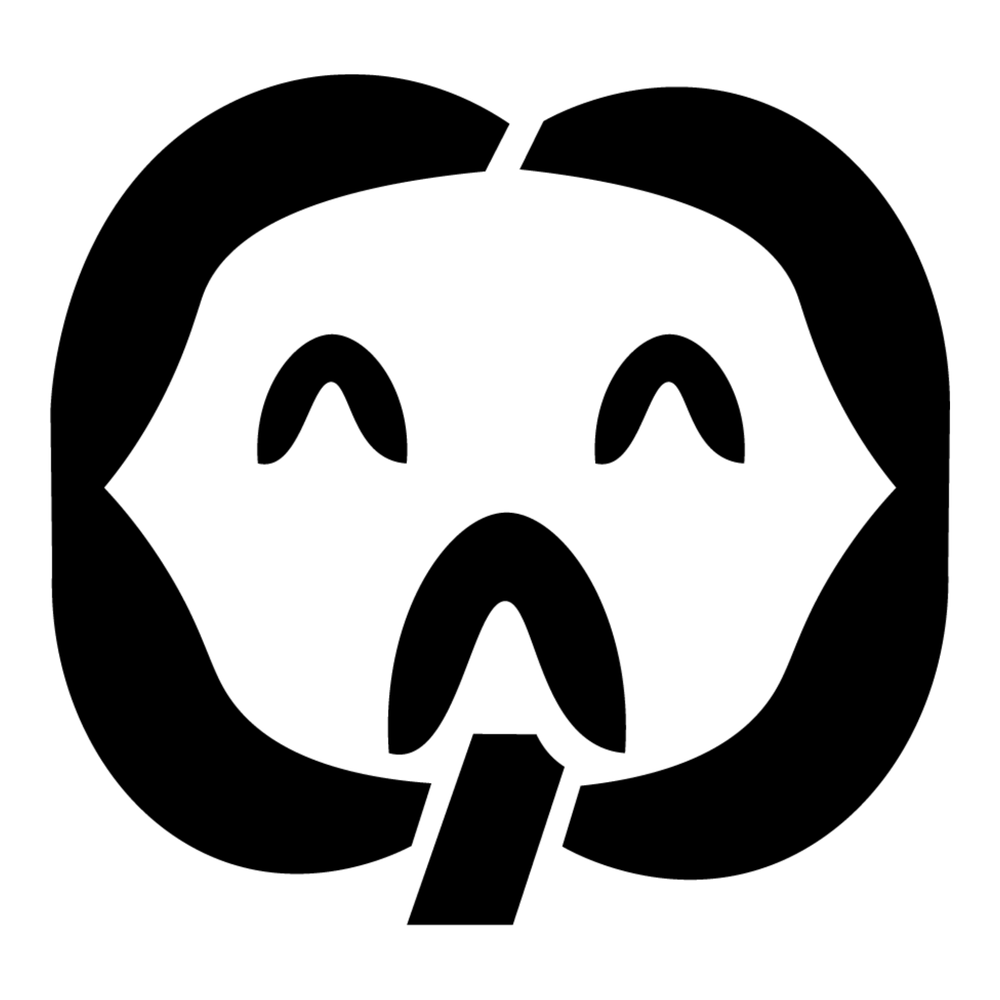

  

  <h1>ZylDEV</h1>

  <h3>Full-Stack Software Developer</h3>

  

    Mobile · Web · Backend · Cloud · AI · 3D
  

  

    
    
    
  

---

## About Me

  I build, learn, break things, and try again. 
  No labels, no perfect story — just curiosity and freedom to create.

---

## Built Without the Performance

  I don't care much about looking impressive. 
  I care about being free enough to create what I want.

  No forced image. 
  No fake perfection. 
  No pretending every project has a deeper meaning.

  I build, experiment, fail, rebuild, and move on.

  Technology is just a tool. 
  The real point is freedom to explore, to learn, and to make something real.

  Less performance. 
  Less approval-seeking. 
  More substance.

  FUCK THE IMAGE. 

---

## Development Focus

<table>
  <tr>
    <td align="center"><b>Mobile</b></td>
    <td align="center">Flutter · Dart · Android Java</td>
  </tr>
  <tr>
    <td align="center"><b>Web</b></td>
    <td align="center">React · JavaScript · Tailwind CSS · Vite</td>
  </tr>
  <tr>
    <td align="center"><b>Backend</b></td>
    <td align="center">FastAPI · Node.js · REST APIs · Celery</td>
  </tr>
  <tr>
    <td align="center"><b>Database</b></td>
    <td align="center">Firebase · Supabase · PostgreSQL · MySQL · Redis</td>
  </tr>
  <tr>
    <td align="center"><b>DevOps</b></td>
    <td align="center">Docker · Git · GitHub</td>
  </tr>
  <tr>
    <td align="center"><b>AI & 3D</b></td>
    <td align="center">LLM Integration · Blender · Unity</td>
  </tr>
</table>

---

## GitHub Overview

---

## Connect

  

ZylDEV

